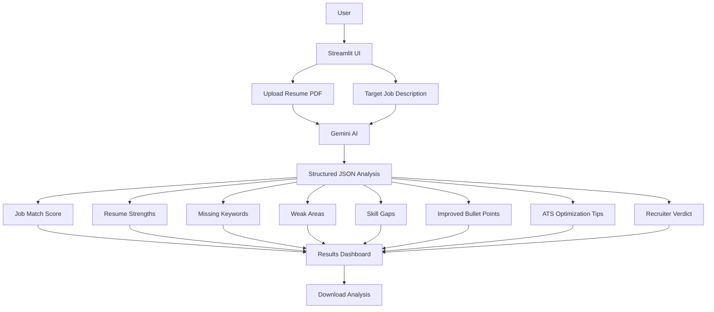

# 🤖 AI Resume Critic

> An AI-powered resume reviewer that analyzes your resume against a target job description and provides recruiter-style feedback.

## 🚀 Project Overview

AI Resume Critic is a Streamlit-based AI application that reviews a resume against a target job description.

The application uses Gemini AI to provide practical, recruiter-focused feedback and helps users understand how well their resume matches a target role.

It analyzes the resume and provides:

- 🎯 Job Match Score
- 💪 Resume Strengths
- 🔑 Missing Keywords
- ⚠️ Weak Areas
- 🎯 Skill Gaps
- ✍️ Improved Resume Bullet Points
- 🤖 ATS Optimization Tips
- 👔 Recruiter Verdict
- 📥 Downloadable Analysis Report

## ✨ Features

- 📄 Upload resume in PDF format
- 🎯 Paste target job description
- 🤖 Gemini AI-powered resume analysis
- 📊 Resume-to-job match score
- 🔑 Missing keyword detection
- ⚠️ Weak area identification
- 🎯 Skill gap analysis
- ✍️ Improved resume bullet suggestions
- 🤖 ATS optimization recommendations
- 👔 Recruiter-style final verdict
- 📥 Download analysis as a text file
- 🎨 Clean and responsive Streamlit dashboard

## 🛠️ Tech Stack

- **Python**
- **Streamlit**
- **Google Gemini API**
- **python-dotenv**
- **JSON**
- **Temporary file handling**

## 🏗️ System Architecture



## 🔄 How It Works

1. The user opens the AI Resume Critic application.
2. The user uploads their resume as a PDF.
3. The user pastes the target job description.
4. The application validates both inputs.
5. The uploaded resume is temporarily stored for processing.
6. The resume PDF is uploaded to Gemini.
7. Gemini receives the resume and target job description.
8. A recruiter-focused prompt instructs Gemini to analyze the resume.
9. Gemini returns structured JSON containing the analysis.
10. The application displays the results in the Streamlit dashboard.
11. The user can review the feedback and download the analysis report.

## 🧠 AI Prompt Engineering

The application uses a structured recruiter-oriented prompt.

Gemini is instructed to:

- Act as an expert technical recruiter and ATS resume reviewer.
- Compare the resume against the target job description.
- Identify missing keywords from the job description.
- Identify weak areas and skill gaps.
- Suggest improved resume bullet points.
- Provide ATS optimization tips.
- Give a concise recruiter verdict.
- Return the analysis in a structured JSON format.

The prompt also instructs the AI not to invent experience, education, or skills and to keep suggested resume improvements truthful to the uploaded resume.

## 📊 Output Analysis

The application generates the following analysis:

### 🎯 Job Match Score

A score from 0–100 representing the resume's alignment with the target job description.

### 💪 Resume Strengths

Highlights the strongest parts of the resume relevant to the target role.

### 🔑 Missing Keywords

Identifies important keywords present in the job description but missing from the resume.

### ⚠️ Weak Areas

Highlights areas where the resume could be stronger.

### 🎯 Skill Gaps

Identifies skills that may be required by the target role but are not clearly demonstrated in the resume.

### ✍️ Improved Resume Bullet Points

Provides recruiter-friendly improvements while keeping suggestions truthful to the original resume.

### 🤖 ATS Optimization Tips

Provides practical recommendations for improving ATS compatibility.

### 👔 Recruiter Verdict

Provides a concise final assessment from a recruiter perspective.

## 🔐 Environment Variables

Create a `.env` file in the project directory:

```text
GEMINI_API_KEY=your_api_key_here
```

**Important:** Never upload your `.env` file or API key to GitHub.

The project uses `.gitignore` to prevent sensitive environment variables from being committed.

## 📁 Project Structure

```text
AI_resume_critic/
│
├── app.py
├── requirements.txt
├── .gitignore
├── .env
└── README.md
```

## ▶️ Run Locally

### 1. Clone the repository

```bash
git clone YOUR_GITHUB_REPOSITORY_URL
```

### 2. Open the project folder

```bash
cd AI_resume_critic
```

### 3. Create a virtual environment

```bash
python -m venv venv
```

### 4. Activate the virtual environment on Windows

```bash
venv\Scripts\activate
```

### 5. Install dependencies

```bash
pip install -r requirements.txt
```

### 6. Add your Gemini API key

Create a `.env` file:

```text
GEMINI_API_KEY=your_api_key_here
```

### 7. Run the application

```bash
streamlit run app.py
```

The application will open in your browser.

## 🌐 Live Demo

**Live App:**  
https://airesumecritic-seu9wgy9whbesbkunke5fy.streamlit.app/

## 📸 Application Screenshots

## 📸 Screenshots

### 🏠 Main Page


### 🤖 AI Analysis Result


### 📥 Download Analysis


## 🎯 Capstone Problem Statement

This project is based on **Problem Statement #17: AI Resume Critic (Tech-Roast)** from the MirAI School of Technology Capstone Project Directory.

The problem statement describes an application where users provide their resume and a target job description, and AI acts as a recruiter to highlight missing keywords and weak bullet points.

## 🎓 Capstone Requirements Addressed

This project demonstrates:

- Streamlit application development
- Git version control
- Gemini AI integration
- Structured prompt engineering
- PDF resume processing
- Dynamic AI-generated analysis
- Session state for preserving analysis results
- Streamlit forms for controlled analysis submission
- Professional dashboard UI
- Downloadable output
- GitHub project documentation

## 🔮 Future Improvements

Possible future improvements include:

- Support for DOCX resumes
- More detailed ATS scoring
- Resume section-by-section analysis
- Job-role-specific recommendations
- Resume rewrite assistance
- Multiple resume comparison
- More detailed recruiter feedback
- Additional export formats such as PDF

## 👩‍💻 Author

**Anushka Singh**

## 🙏 Acknowledgements

Built as part of the **MirAI School of Technology B.Tech Streamlit & AI Capstone Project**.

---

### ⭐ AI Resume Critic

**Built with Python + Streamlit + Gemini AI**
